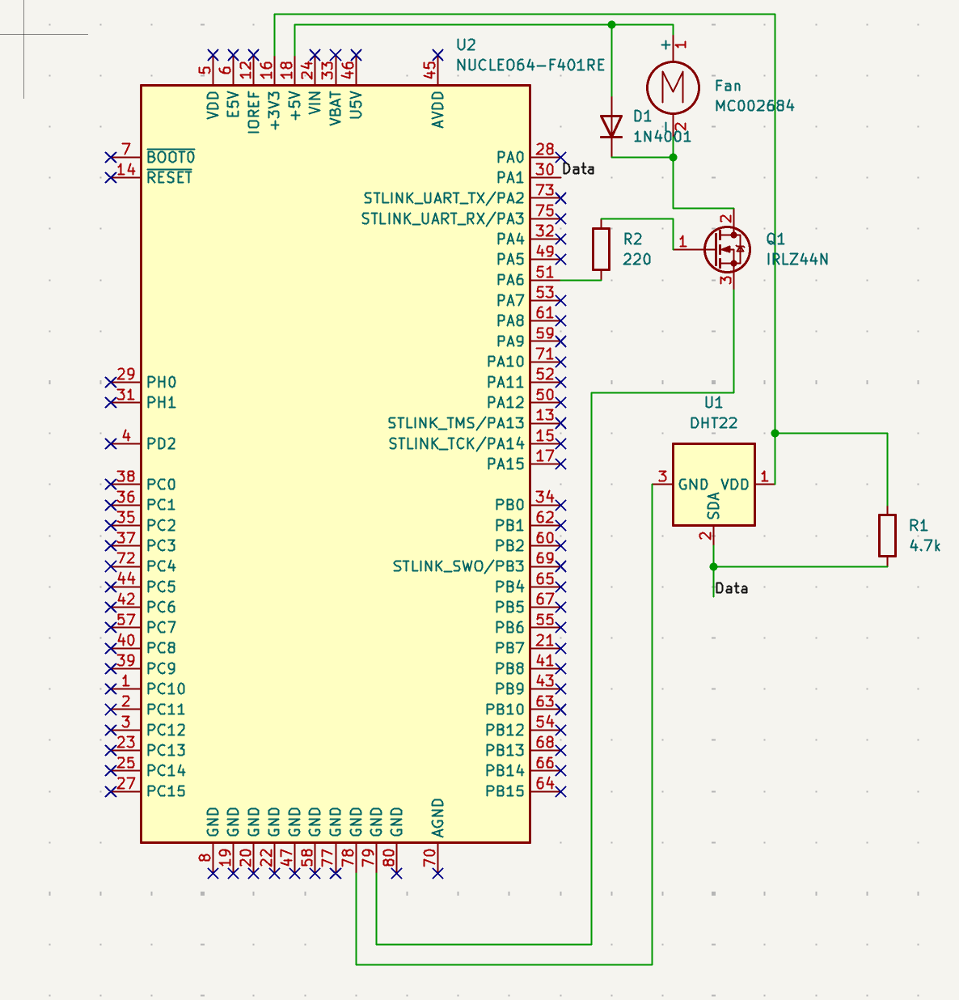

# Closed-Loop Thermal Management System

## Overview
[What it is, what it demonstrates — control theory + embedded firmware]

## Hardware
- STM32 Nucleo-F401RE
- DHT22 temperature/humidity sensor
- IRLZ44N logic-level MOSFET
- MC002684 5V DC fan
- 1N4001 flyback diode
- 4.7kΩ pull-up, 220Ω gate resistor

## System Architecture
[Block diagram — sensor -> PID -> PWM -> fan -> thermal mass -> sensor, closing the loop]

## Plant Characterization
[Open-loop step response plot from Phase 5, measured tau and K values]

## Controller Design
[PID equations, anti-windup approach, initial gain derivation from tau/K]

## Results
### Closed-Loop Tuning
[Comparison plot across tuning attempts, final chosen gains]
### Disturbance Rejection
[Plot + embedded gif/video link from Phase 8]

## Firmware Architecture
[Brief overview: DHT22 bit-banged driver, TIM2 microsecond timer, TIM3 PWM,
PID class, UART CSV streaming — link to Firmware/README.md]

## MATLAB Analysis
[Brief overview: plant_characterization.m, pid_tuning_analysis.m,
live_plot.m — link to MATLAB/README.md]

## Lessons Learned
[What you'd write once you've actually built it — be honest about
what was harder than expected, what surprised you about tuning, etc.]

## Future Work
- Add a controlled heating element for two-directional control
- Migrate to a custom PCB
- Add UART setpoint commands for remote configuration
- Compare PID against a simpler bang-bang/hysteresis controller as a baseline
